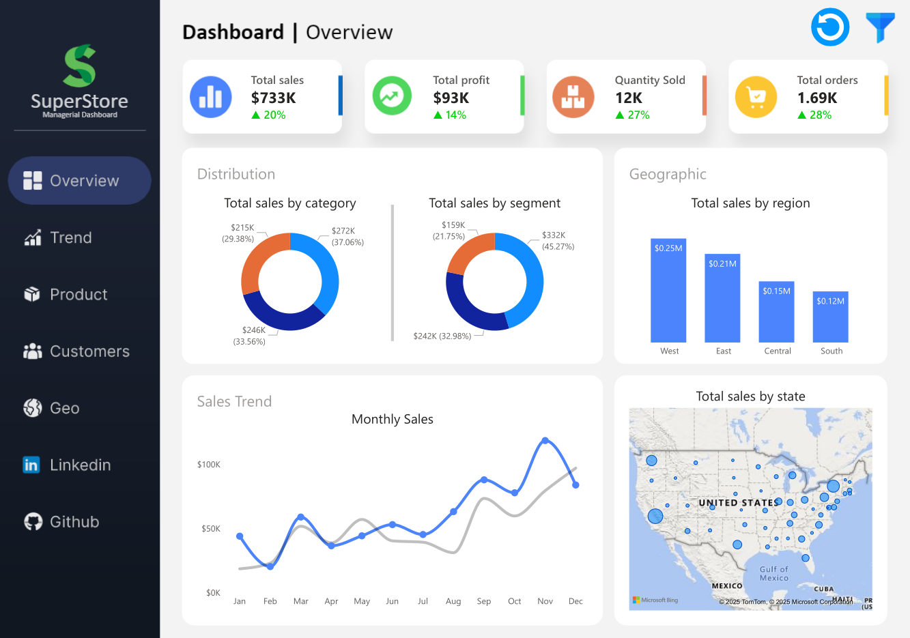
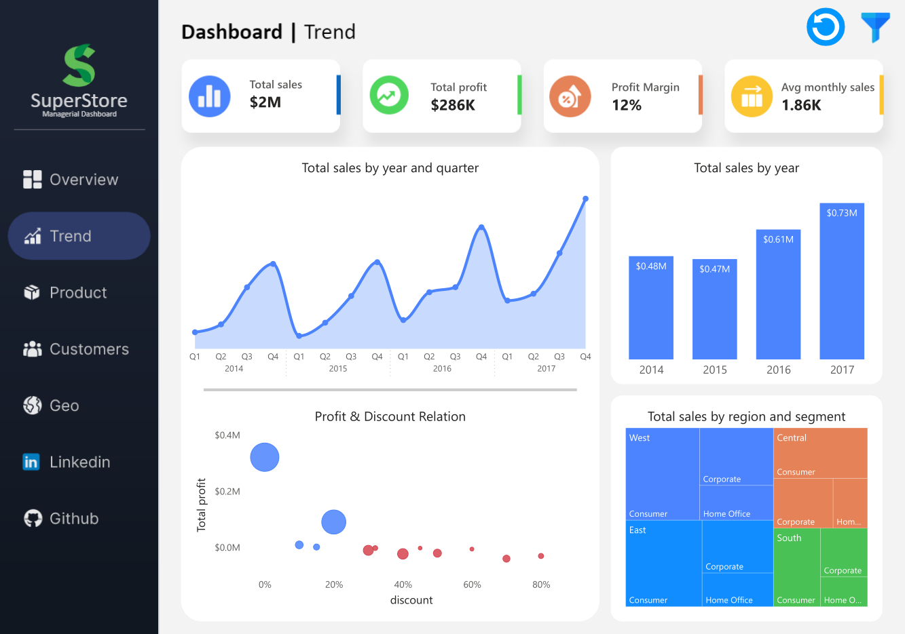
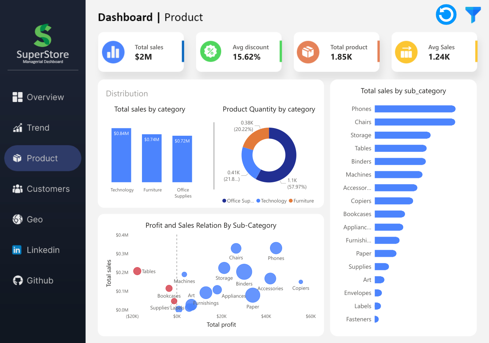
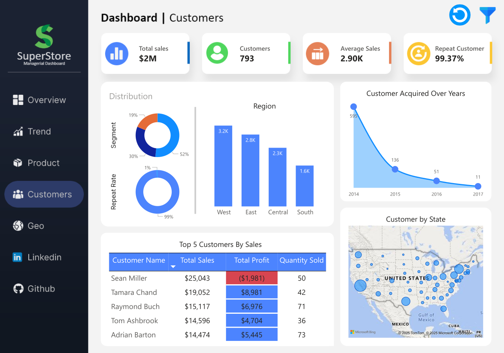
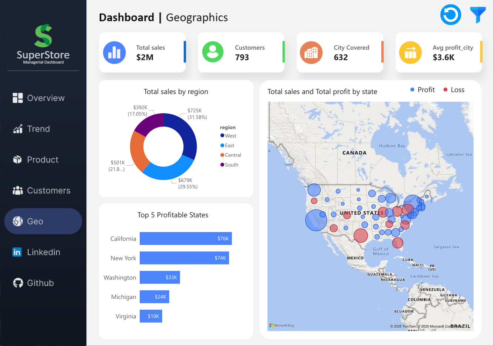

# 📊 End-to-End Sales & Profit Analysis with SQL & Power BI

## 🔹 Overview
This is an **end-to-end data analytics project** that takes raw sales data through the full analytics lifecycle — from **SQL-based data cleaning and exploration** to an **interactive Power BI dashboard**.  
The aim is to uncover trends, patterns, and insights to drive better business decisions.

---

## 🛠 Tech Stack
- **SQL (MySQL 8.0)** – Data cleaning, transformation, and exploratory analysis  
- **Power BI** – Interactive visualizations and dashboards  
- **DAX** – Calculated columns and measures for KPIs  
- **Excel** – Data export and quick checks  

---

## 📌 Project Workflow

1. **Data Acquisition & Import**  
   - Imported raw sales transaction data into MySQL.

2. **Data Preparation in SQL**
   - Imported raw sales data into MySQL  
   - Handled Nulls and Data inconsistency
   - Removed duplicates and standardized values
   - Normalizing Table into Dimensions and Fact Tables. 

3. **Exploratory Data Analysis (MySQL)**  
   - Answered **30 business questions** using SQL queries to explore patterns, trends, and anomalies.  
   - Example questions:  
     - Which product categories generate the highest profit margins?  
     - How do sales trends vary across months and regions?  
     - How Discount rate affects Profits?   
   - 📂 [Exploratory Data Analysis](./SQL/Exploratory%20Data%20Analysis)  

4. **Data Modeling in Power BI**
   - Designed star schema with fact and dimension tables  
   - Created a Date table for time intelligence  
   - Wrote DAX measures for KPIs  

5. **Dashboard Creation**
   - **Overview:** Total Sales, Profit, Orders trend  
   - **Trend Analysis:** Sales and Profit trend over years 
   - **Product Analysis:** Sales and Profit Distribution among Product Categories
   - **Customer Segmentation:** Analysis by segments and loyalty  
   - **Geographic Analysis:** Map visualization for geographic performance

6. **Insights & Recommendations**  
   - Derived actionable insights from dashboard analysis (see details below).

---

### 💡 Key Insights from Dashboard
- **Seasonal Sales Spike:** Revenue shows a significant increase in **Q4**, indicating strong seasonal demand.  
- **Discount Strategy Impact:** Discounts above **20%** consistently result in losses, while minimal or no discounts maximize profitability.  
- **Customer Trends:** New customer acquisition rates are declining, but **repeat purchase rates remain strong**, suggesting a loyal customer base.  
- **High-Performing Product Line:** The **Copiers** sub-category generates the highest combined sales and profit despite lower sales volume, indicating a premium, high-margin product.  

---

## 📷 Dashboard Preview

### Overview Page

### Sales and Profit Analysis

### Product Analysis

### Customer Insights

### Geographical Performance

